[](https://arxiv.org/abs/2608.05603)
[](https://doi.org/10.5281/zenodo.21981120)


# Interface Engineering of Helium Confinement in Argon-Preplated MCM-41 Nanopores

Rahul Soni, Nathan S. Nichols, Sutirtha Paul, Garfield Warren, Paul Sokol and Adrian Del Maestro

[arXiv:2608.05603](https://arxiv.org/abs/2608.05603)

### Abstract
Atomic-scale modification of mesopore interfaces provides a route to tune the confinement experienced by adsorbed fluids, but how a specific interface preparation translates into the resulting microscopic confinement potential remains unclear. Here, we show that preplating MCM-41 with an argon monolayer modifies the effective pore interface by occupying strongly attractive regions of the heterogeneous silica surface and screening its atomic-scale corrugation. Grand-canonical Monte Carlo simulations of argon adsorption, low-temperature molecular dynamics, and helium test-particle insertion are combined with adsorption isotherms and neutron-scattering measurements to characterize the preplated pore at the atomic scale. Helium test-particle insertion calculations show that the modified interface shifts the helium adsorption minimum to an annular region inside the pore and produces a confinement landscape dominated by a smooth radial component.  The resulting radial confinement potential can be described by a continuum cylindrical model, providing microscopic support for the effective potential used in earlier quantum Monte Carlo studies. Residual corrugation persists over multiple spatial scales and is accurately captured by a Gaussian process surrogate. These results demonstrate how atomic preplating can tailor nanopore confinement and provide an experimentally constrained microscopic potential for predictive studies of confined quantum fluids.


### Description
This repository includes data files, scripts, codes and analysis used to generate the figures in this paper.

### Data
The data in this project was generated via LAMMPS. Since several LAMMPS trajectory/dumps and TPI datasets are too large for a convenient distribution through GitHub, the data associated with this project are divided between **GitHub** and **Zenodo**.

#### Data included in GitHub
This repository contains the smaller datasets and processed data files in the [data](https://github.com/DelMaestroGroup/papers-code-ArMCMTPI/tree/main/data) directory, required for the analysis and figures. The included files are under these subdirectories:
```text
data/
data/lammps/Ar_nstats/
data/lammps/Str_factor/
```

as well as the MCM structure and selected processed configurations for visualization via OVITO:

```text
data/lammps/Data_MCM_2x1x5.data
data/lammps/Data_MCM_Ar_MD_90K.data
data/lammps/Data_MCM_Ar_frozen_4K.data
data/lammps/Nexp_data_MCM-41_Ar.txt
```

#### Data stored on Zenodo
The following two large subdirectories are stored on Zenodo:

```text
Ar_dumpfiles/
TPI_data/
```

`Ar_dumpfiles/` contains the GCMC Ar trajectory/dump files for the five independent simulation seeds and chemical-potential scan.

`TPI_data/` contains the data generated from the helium test-particle insertion calculations, including the multiple frozen Ar+MCM configurations used for averaging.

The datasets can be downloaded through [](https://doi.org/10.5281/zenodo.21981120).

After downloading the datasets from Zenodo place the two subdirectories under `data/lammps/`, so that the repo has the following structure:

```text
data/lammps/
-> Ar_nstats/
-> Ar_dumpfiles/       # downloaded from Zenodo
-> TPI_data/           # downloaded from Zenodo
-> Str_factor/
```

### Software requirements

The workflow was generated in a Linux/HPC environment and the following softwares were used to obtain the raw & processed data and figures:

- Bash
- LAMMPS (version: 29 Oct 2020)
- NumPy and Python3
- Gnuplot 
- `pdftoppm` (for PDF-to-PNG conversion)


### Obtaining raw & processed data
Unless stated otherwise, the bash scripts in `src/` should be executed from the main directory and not from inside 'src/'

For multiseed GCMC runs at 90 K do:
```bash
bash src/Submit_GCMC_multiseed_runs.sh
```

To collect raw GCMC data, as well as analyse and generate processed GCMC data, do the following:
```bash
bash src/data_collection_GCMC_multiseed.sh
bash src/data_analysis_nstats.sh
bash src/data_analysis_gr_rho.sh
bash src/data_analysis_Sq.sh
```

For multiseed MD and TPI runs at 4 K do:
```bash
bash src/Submit_MD_multiseed_runs.sh
bash src/Submit_TPI_multiseeed_runs.sh
```

To collect raw TPI data, as well as analyse and generate processed TPI data, do the following:
```bash
bash src/data_collection_TPI.sh
bash src/data_analysis_TPI.sh
```

Once all the raw and processed data has been stored in the `data/` directory, generate all the paper figures by running the `Create_figures.sh` script inside `plotting_scripts/` subdirectory. Note that, the script should be executed from `src/plotting_scripts/` as:

```bash
bash Create_figures.sh
```


### Support
This work was performed with support from the U.S. Department of Energy, Office of Science, Office of Basic Energy Sciences, under Award Number DE-SC0024333.  Nathan S. Nichols was supported by the Office of Science, U.S. Department of Energy, under contract DE-AC02-06CH11357.


### Figures

#### Figure 1: Sturture of the $2\times 1\times 5$ MCM-41 pore


#### Figure 2: Adsorption uptake of argon inside MCM-41 pore as a function of relative pressure $P/P_{0}$ 
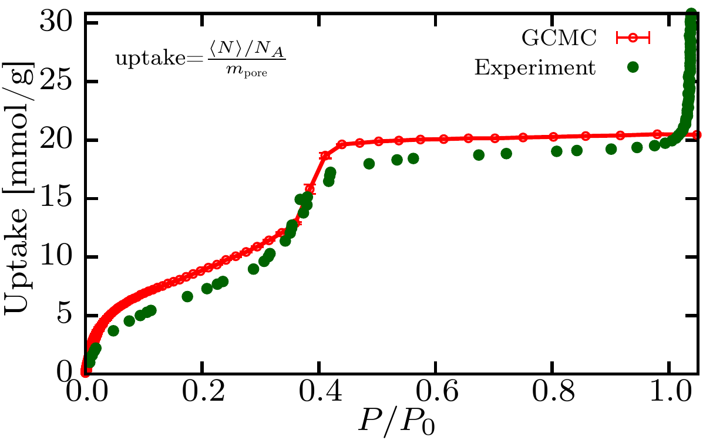

#### Figure 3: Radial density profiles for selected chemical potentials
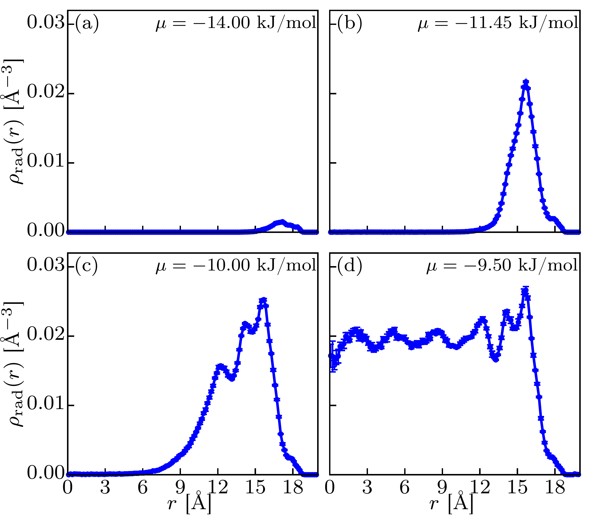

#### Figure 4: Ar-Ar pair correlation function of monolayer
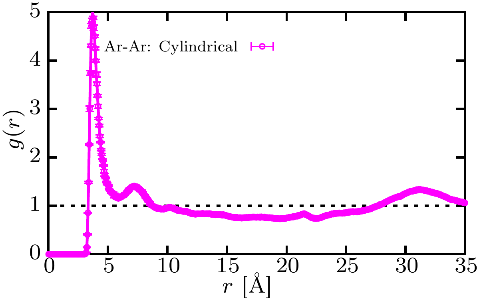

#### Figure 5: Debye powder averaged structure factor of Ar-Ar + Ar-MCM
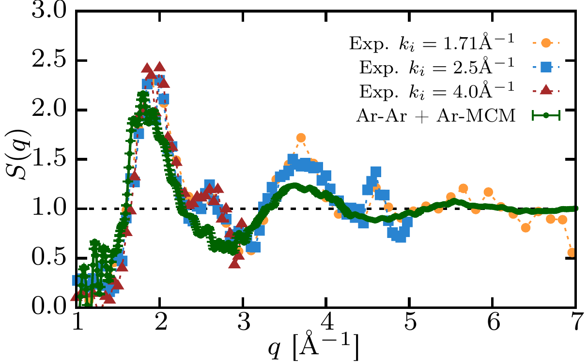

#### Figure 6: Top view of Ar inside MCM-41 at $T=90$ K and $T=4$ K
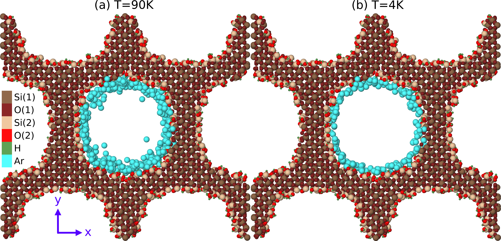

#### Figure 7: Helium confinement potential heatmap
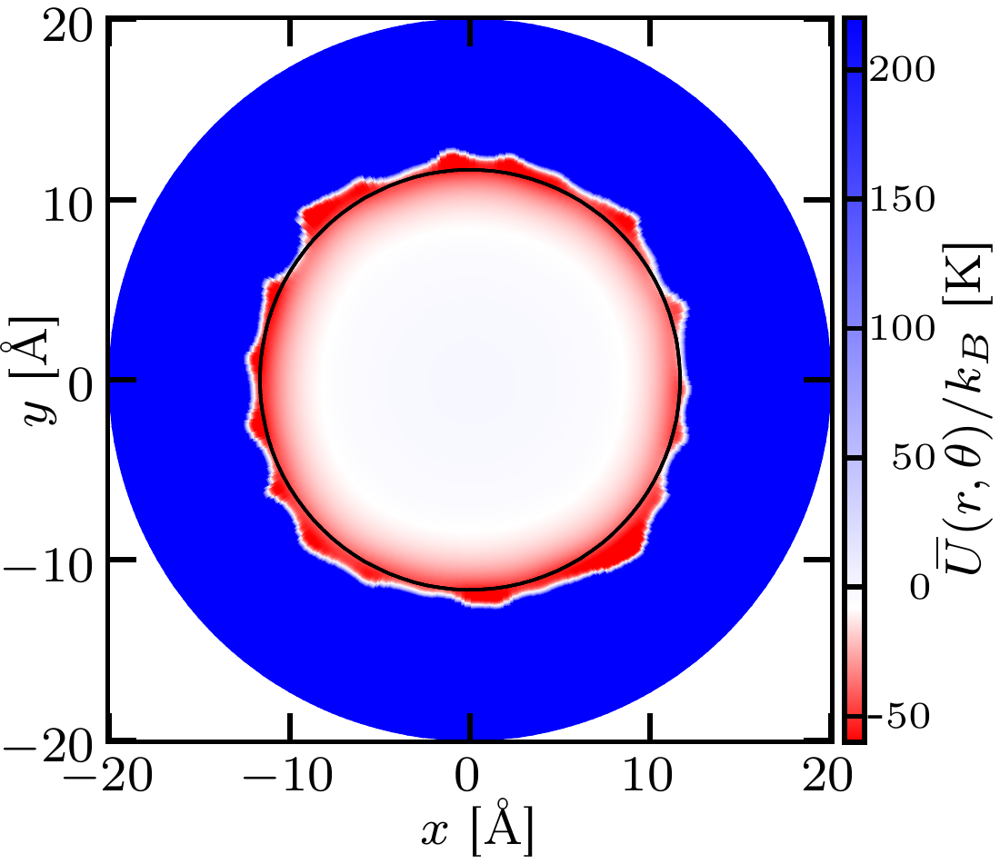

#### Figure 8: Cylindrically averaged helium confinement potential
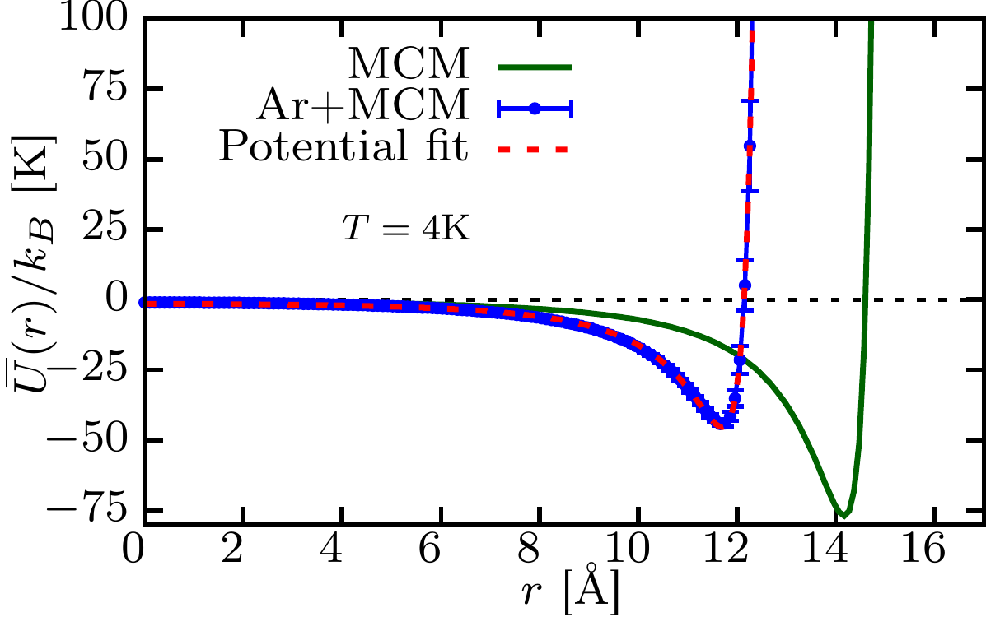

#### Figure 9: Screeing factor
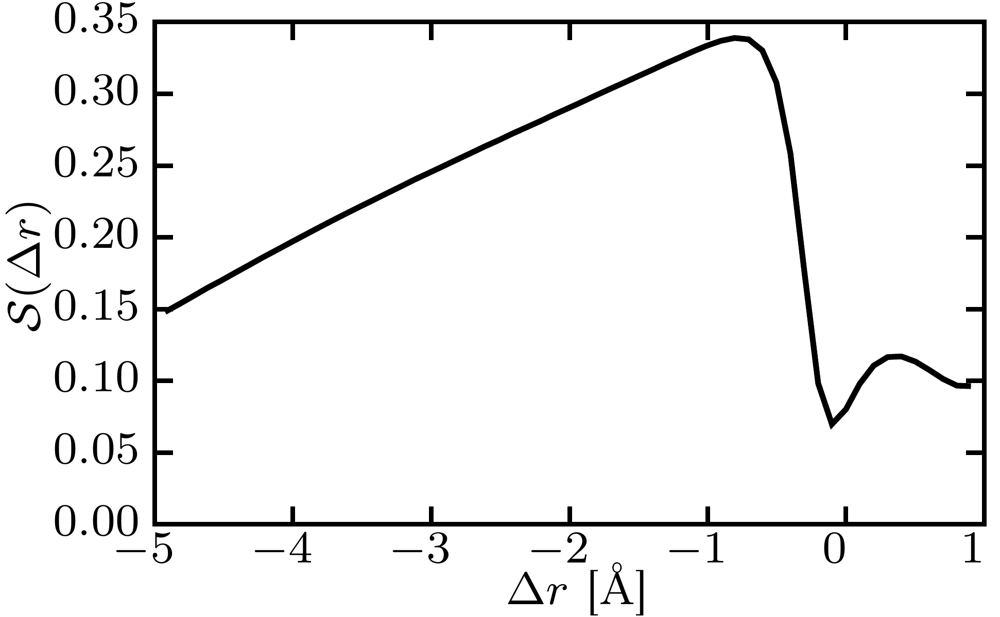

#### Figure 10: Z disorder 
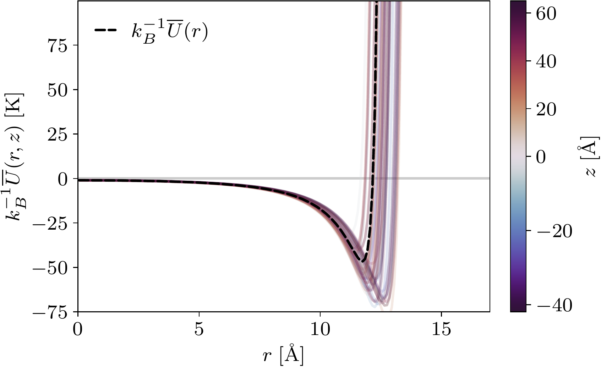

#### Figure 11: Disorder Analysis 
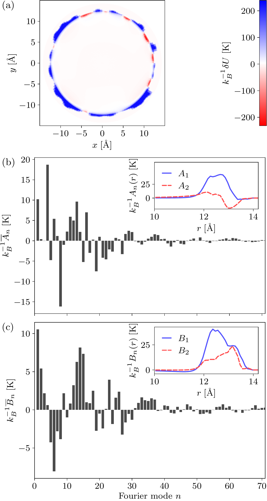

#### Figure 12: GP comparisons 
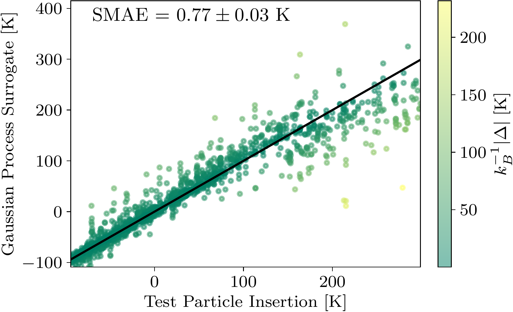

#### Figure 13: First and second Ar layer occupancies
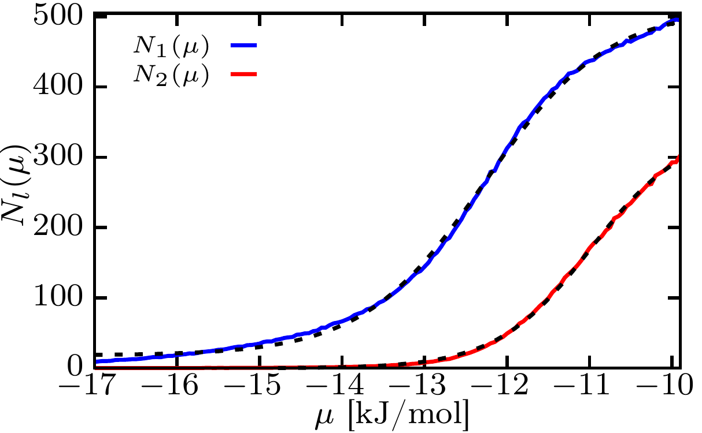

#### Figure 14: First order derivatives of the first and second Ar layer occupancies
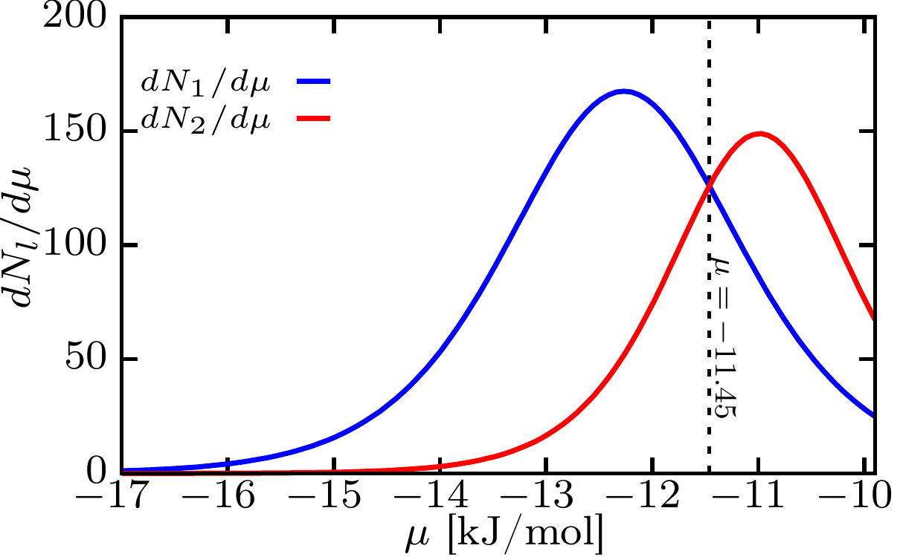

